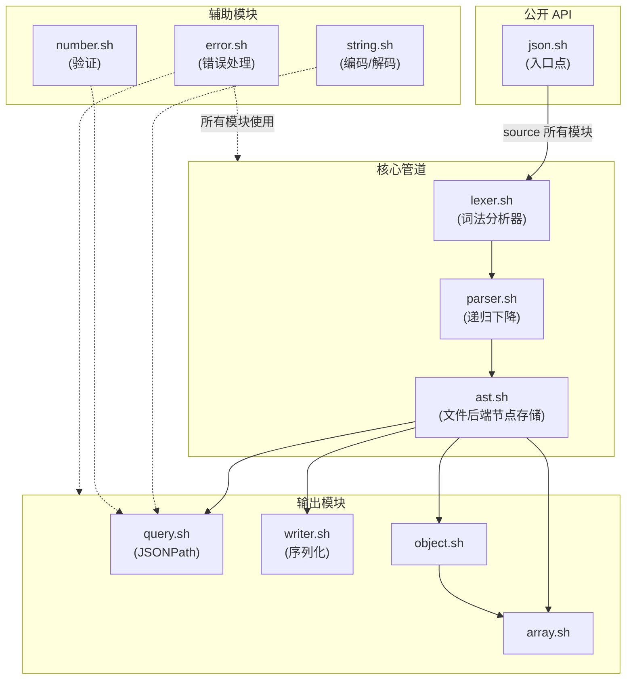
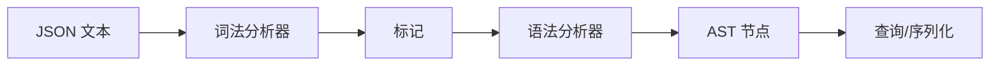
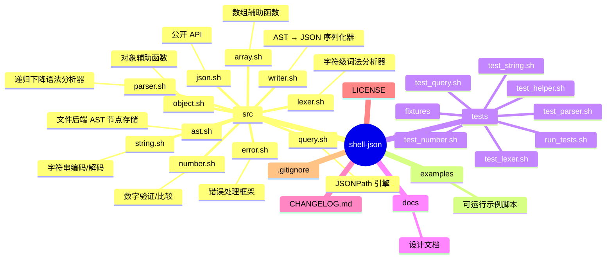

# shell-json

[](LICENSE)

[**English**](README.md)

一个完全用纯 Bash 实现的 JSON 解析与查询库。无外部依赖——不需要 `jq`、`python`、`grep`/`sed` 之类的工具。

## 架构

编译器风格管道：**词法分析器 → 语法分析器 → 文件后端 AST → 查询/序列化**



## 特性

- **完整的 JSON 解析** — 字符串（支持 Unicode/代理对）、数字（以字符串形式保持任意精度）、布尔值、null、对象、数组
- **文件后端的 AST** — 节点存储在 `/tmp`，通过 `json.free` 自动清理
- **JSONPath 查询** — 完整的 RFC 9535 子集：`$`、`@`、点号和方括号表示法、`[0]`、`[*]`、`$..key`、切片 `[1:3]`、联合 `[0,1]`、过滤器 `[?(@.price<10)]`
- **紧凑与美化序列化** — `json.dump "$root"` 或 `json.dump "$root" 2`
- **错误处理** — 带有错误码和行号:列号位置的结构化错误
- **纯 Bash** — 可在任何 POSIX 兼容的 shell 环境中运行

## 快速开始

```bash
#!/usr/bin/env bash
source ./src/json.sh

# 解析 JSON 文件
root=$(json.parse "data.json") || { echo "Error: $(json.last_error)"; exit 1; }

# JSONPath 查询
results=$(json.query "$root" '$.store.book[*].title')
for node in $results; do
    echo "$(json.dump "$node")"
done

# 序列化为美化格式的 JSON
pretty=$(json.dump "$root" 2)
echo "$pretty"

# 释放资源
json.free "$root"
```

### 从字符串解析

```bash
root=$(json.parse_string '{"name":"test","value":42}')
echo "$(json.dump "$root")"
# {"name":"test","value":42}
json.free "$root"
```

### JSONPath 示例

```bash
# 根节点
json.query "$root" '$'

# 点号表示法
json.query "$root" '$.store.book'

# 方括号表示法
json.query "$root" "$['store']['book']"

# 数组索引
json.query "$root" '$.store.book[0]'

# 通配符
json.query "$root" '$.store.book[*].title'

# 递归下降
json.query "$root" '$..author'

# 切片
json.query "$root" '$.store.book[0:2]'

# 联合
json.query "$root" '$.store.book[0,2]'

# 过滤器
json.query "$root" '$.store.book[?(@.price < 10)]'
```

## 模块

| 模块 | 描述 | 核心函数 |
|--------|-------------|---------------|
| `error.sh` | 错误处理框架，含错误码和位置信息 | `error_set`, `error_get`, `error_clear`, `error_code`, `error_msg` |
| `ast.sh` | 文件后端的 AST 节点存储（base64 编码的值） | `ast_create`, `ast_get_type`, `ast_get_value`, `ast_set_child`, `ast_set_child_with_key`, `ast_destroy` |
| `string.sh` | JSON 字符串编码/解码，支持 Unicode | `string_encode`, `string_decode` |
| `number.sh` | 数字验证与比较（无精度损失） | `number_validate`, `number_compare` |
| `lexer.sh` | 字符级 JSON 词法分析器 | `lexer_init`, `lexer_advance`, `lexer_peek`, `lexer_get_position` |
| `parser.sh` | 递归下降语法分析器 | `parser_parse` |
| `object.sh` | 对象辅助函数（get、keys、has、length） | `object_get`, `object_keys`, `object_has`, `object_length` |
| `array.sh` | 数组辅助函数（get、length） | `array_get`, `array_length` |
| `writer.sh` | AST → JSON 序列化器（紧凑 + 美化） | `writer_write` |
| `query.sh` | JSONPath 引擎（RFC 9535） | `query_execute` |
| `json.sh` | 公开 API 入口——只需 source 此文件 | `json.parse`, `json.parse_string`, `json.query`, `json.dump`, `json.free`, `json.last_error`, `json.clear_error` |

## API 参考

### `json.parse <文件路径>`

解析 JSON 文件并返回 AST 根节点 ID。

```bash
root=$(json.parse "data.json")
root=$(json.parse "data.json") || { echo "parse failed"; exit 1; }
```

### `json.parse_string <字符串>`

解析 JSON 字符串并返回 AST 根节点 ID。

```bash
root=$(json.parse_string '{"key": "value"}')
root=$(json.parse_string "$json_str") || { echo "parse failed"; exit 1; }
```

### `json.query <根节点ID> <路径>`

对 AST 执行 JSONPath 查询。每行输出一个匹配的节点 ID。

| 参数 | 说明 |
|----------|-------------|
| `root_id` | AST 根节点 ID（来自 `json.parse` / `json.parse_string`） |
| `path` | JSONPath 表达式（参见 [JSONPath 参考](#jsonpath-参考)） |

```bash
results=$(json.query "$root" '$.store.book[*].title')
for node in $results; do
    json.dump "$node"
done
```

### `json.dump <节点ID> [缩进]`

将 AST 节点序列化为 JSON 文本。

| 参数 | 说明 |
|----------|-------------|
| `node_id` | 要序列化的 AST 节点 ID |
| `indent` | *（可选）* `0` = 紧凑（默认），`2` = 美化打印 |

```bash
json.dump "$root"        # 紧凑: {"a":1}
json.dump "$root" 2      # 美化: {\n  "a": 1\n}
```

### `json.free <根节点ID>`

释放所有 AST 资源（临时目录）。操作完成后务必调用。

```bash
json.free "$root"
```

### `json.last_error`

返回最后一条错误消息（如果没有错误则返回空字符串）。

```bash
json.parse "bad.json" || {
    echo "Error: $(json.last_error)" >&2
    exit 1
}
```

### `json.clear_error`

清除错误状态。在失败后重试之前调用。

```bash
json.clear_error
```

## 错误码

| 错误码 | 常量 | 含义 |
|------|----------|---------|
| 1 | `_JSON_ERR_GENERAL` | 一般解析错误 |
| 2 | `_JSON_ERR_LEXER` | 词法错误（非法字符、未闭合的字符串） |
| 3 | `_JSON_ERR_PARSER` | 语法错误（意外的标记） |
| 4 | `_JSON_ERR_TYPE` | 类型错误（如对字符串使用索引） |
| 5 | `_JSON_ERR_KEY_NOT_FOUND` | 对象中未找到键 |
| 6 | `_JSON_ERR_INDEX_OOB` | 索引越界 |
| 7 | `_JSON_ERR_PATH_SYNTAX` | JSONPath 语法无效 |
| 8 | `_JSON_ERR_IO` | 内部 / I/O 错误 |

## JSONPath 参考

| 语法 | 示例 | 描述 |
|--------|---------|-------------|
| 根节点 | `$` | 根对象/数组 |
| 当前节点 | `@` | 当前节点（过滤器上下文） |
| 点号子节点 | `$.store.book` | 对象点号表示法 |
| 方括号子节点 | `$['store']['book']` | 对象方括号表示法 |
| 数组索引 | `$[0]` | 整数数组索引 |
| 通配符 | `$[*]`, `$.*` | 所有子节点 |
| 递归下降 | `$..author` | 深度搜索指定键 |
| 切片 | `$[1:3]`, `$[0:-1]`, `$[::2]` | 数组切片 |
| 联合 | `$[0,1]`, `$['a','b']` | 多选择器 |
| 过滤器 | `$[?(@.price<10)]` | 谓词过滤器 |

**过滤器表达式**支持：
- 比较：`==`、`!=`、`<`、`>`、`<=`、`>=`
- 逻辑运算：`&&`、`||`
- 一元运算：`!`
- 分组：`( ... )`
- 字面量：`'...'`（字符串）、数字、`true`、`false`、`null`
- 属性访问：`@.key`、`@.length`

## 工作原理

库采用编译器风格的管道：



1. **词法分析器**（`lexer.sh`）— 逐字符读取 JSON，生成标记
   （STRING、NUMBER、TRUE、FALSE、NULL、LBRACE、RBRACKET 等）
2. **语法分析器**（`parser.sh`）— 递归下降语法分析器，消费标记
   并通过 `ast_create()` 调用构建 AST。
3. **AST**（`ast.sh`）— 文件后端的节点存储，位于 `/tmp`。每个节点是一个
   小文件，包含类型、值（base64 编码）、子节点 ID 和键。
4. **查询**（`query.sh`）— 对 AST 求值 JSONPath 表达式，
   返回匹配的节点 ID。
5. **序列化器**（`writer.sh`）— 递归遍历 AST 并将其序列化
   回 JSON 文本（紧凑或美化打印）。

### 为什么不需要外部依赖？

大多数 JSON 库依赖 `jq`、Python 或 `grep`/`sed` 的方式。shell-json
完全基于 Bash 内置命令和标准 POSIX 工具（`mktemp`、
`base64`、`sed`）编写。这使得它在任何运行 Bash 的环境中都是
可移植的——容器、嵌入式系统、CI 流水线——无需
安装任何额外的工具。

### AST 存储详情

每次调用会在 `/tmp/shell-json.XXXXXX/` 下创建一个临时目录：

```
/tmp/shell-json.XXXXXX/
  counter       ← 自增节点 ID 计数器
  nodes/
    0000001     ← 节点文件（4 行：类型|值|子节点|键）
    0000002
    ...
```

值经过 base64 编码以安全处理任意字符串，包括
换行符、Unicode 和二进制数据。调用 `json.free` 以清理资源。

## 项目结构



## 测试

```bash
# 运行全部测试
bash tests/run_tests.sh

# 运行指定测试套件
bash tests/run_tests.sh lexer
bash tests/run_tests.sh number
bash tests/run_tests.sh parser
bash tests/run_tests.sh query
bash tests/run_tests.sh string
```

全部 273 个测试通过。

## 限制

- **不支持流式/SAX** — 必须先完整解析 JSON 才能查询
- **不支持修改** — 只读查询接口
- **不支持 JSON Schema**
- **单线程** — 每个 shell 会话一次调用（每次调用创建独立的临时目录）

有关性能、并发安全、临时文件清理、跨 shell 兼容性和 JSONPath 限制等
所有已知局限的详细讨论，请参见[已知限制文档](docs/limitations.md)。

## 设计文档

深入了解库的内部原理——词法分析器标记类型、语法分析器文法、
AST 文件格式和 JSONPath 求值算法——请参见
[设计规范](docs/superpowers/specs/2026-07-17-shell-json-design.md)。

## 许可证

MIT

## 兼容性

### 要求

| 要求 | 详情 |
|-------------|---------|
| **Bash** | 4.3+（使用 `local -n` 名称引用进行 Unicode 解码） |
| **外部工具** | `mktemp`、`base64`、`sed`（Linux/macOS 标准工具） |
| **编码** | 推荐 UTF-8 语言环境以获得正确的 Unicode 支持 |
| **不支持** | `sh`、`dash`；Bash < 4.3 |

### 可移植性说明

- 该库使用 Bash 特定的特性：`[[ ]]` 条件表达式、`$(( ))` 算术运算、`local -n` 名称引用、`printf -v` 和 ANSI-C 引用（`$'\n'`）。
- 在 macOS 上，默认的 Bash 是 3.2 版本。请通过 Homebrew（`brew install bash`）升级或使用包含 Bash 4.3+ 的容器。
- `base64` 标志在 GNU 和 BSD 实现之间有所不同——代码通过回退逻辑处理了这两种情况。

## 错误处理

使用 `json.last_error` 在操作失败后检查错误：

```bash
source ./src/json.sh

# 解析并处理错误
root=$(json.parse "data.json") || {
    echo "Parse failed: $(json.last_error)" >&2
    json.clear_error          # 在重试/退出前清除错误状态
    exit 1
}

# 查询可能返回空结果（不是错误）
results=$(json.query "$root" '$.nonexistent.key')
if [[ -z "$results" ]]; then
    echo "No matches found"
fi

# 序列化并检查错误
output=$(json.dump "$root") || {
    echo "Serialization failed: $(json.last_error)" >&2
    exit 1
}

# 始终清理资源
json.free "$root"
```
